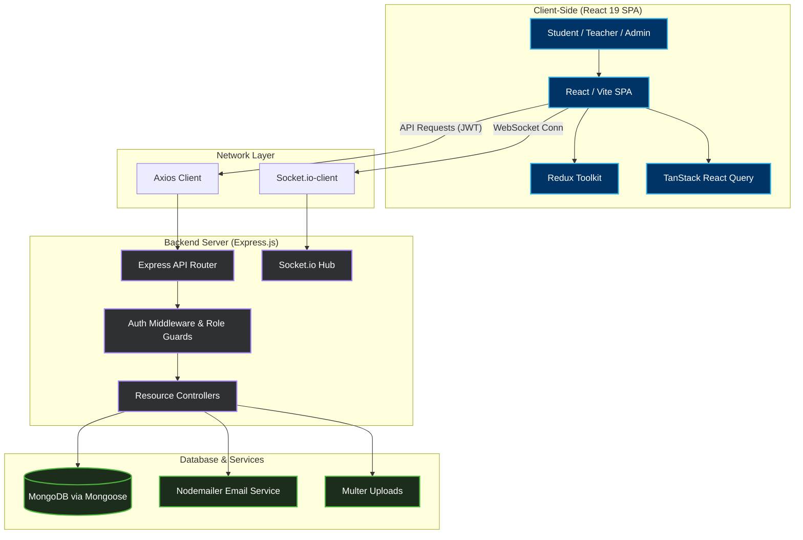
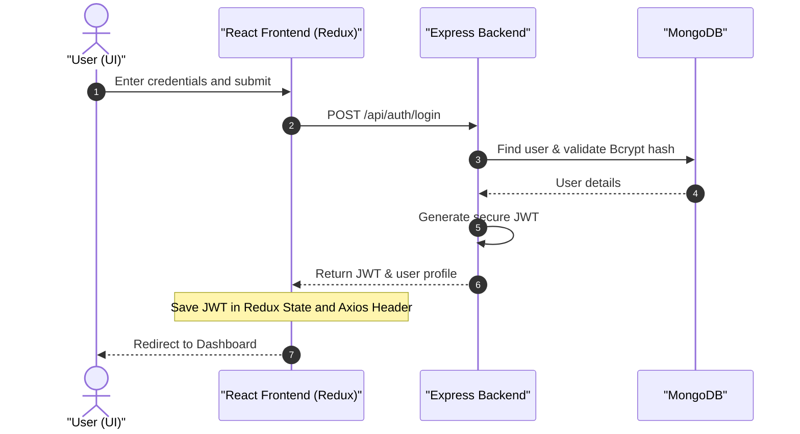

<h1 align="center">🏫 Smart College Management System (SCMS)</h1>

<p align="center">
  A state-of-the-art, feature-rich, and secure <strong>Full-Stack College Management System</strong> designed for modern academic institutions. Built using high-performance technologies like <strong>React 19</strong>, <strong>Vite</strong>, <strong>TypeScript</strong>, <strong>Tailwind CSS v4</strong>, and <strong>Express.js</strong>, SCMS provides an interactive, role-based ecosystem for Students, Teachers, and HODs / Administrators.
</p>

<p align="center">
  <a href="https://github.com/affanraza84/collegems">
    
  </a>
  
  
  
  
  
</p>

---

## 📌 Table of Contents

- [🚀 Key Features](#-key-features)
  - [🔐 Authentication & Authorization](#-authentication--authorization)
  - [👨‍🎓 Student Module](#-student-module)
  - [👨‍🏫 Teacher Module](#-teacher-module)
  - [👑 HOD / Admin Module](#-hod--admin-module)
  - [📊 Analytics & Reports](#-analytics--reports)
  - [⚡ Real-Time & AI Features](#-real-time--ai-features)
- [🛠️ Tech Stack & Ecosystem](#️-tech-stack--ecosystem)
  - [Frontend](#frontend)
  - [Backend](#backend)
- [📈 Application Workflow](#-application-workflow)
- [⚙️ Local Setup Guide](#️-local-setup-guide)
  - [Pre-requisites](#pre-requisites)
  - [1. Backend Setup](#1-backend-setup)
  - [2. Frontend Setup](#2-frontend-setup)
- [📁 Project Directory Structure](#-project-directory-structure)
- [☁️ Deploy on Render](#️-deploy-on-render)
- [🤝 Contributing (SSOC '26)](#-contributing-ssoc-26)
- [⭐ Show Your Support](#-show-your-support)
- [👤 Author](#-author)

---

## 🚀 Key Features

SCMS is structured around role-based modules, ensuring that every user has a tailored experience specific to their tasks and permissions.

### 🔐 Authentication & Authorization
- **Secure JWT Authentication**: Industry-standard access token structure stored in global state.
- **Role-Based Access Control (RBAC)**: Fine-grained dashboard view filtering for Students, Teachers, and HODs.
- **Security Protocols**: Password hashing via BcryptJS, secure API middlewares, and cors configuration.

### 👨‍🎓 Student Module
- **Comprehensive Profile**: Personal profile details, department information, and registration records.
- **Academics & Attendance**: Real-time view of class attendance percentages and detailed logs.
- **Assignments & Exams**: Track and submit assignments; view grades, exam schedules, and academic reports.
- **Finances**: Access detailed fee structures, outstanding balances, payment status, and download official fee receipts in PDF format.

### 👨‍🏫 Teacher Module
- **Academics Control**: Create, manage, and assign courses/subjects to classes.
- **Attendance Registry**: Easy-to-use digital attendance marker with performance tracking.
- **Assignment Hub**: Create assignments, set deadlines, and grade student submissions directly.
- **Performance Grading**: Record and publish exam/test results seamlessly.

### 👑 HOD / Admin Module
- **User Control Panel**: Add, edit, or remove Student, Teacher, and Administrator accounts.
- **Academics Scheduling**: Oversee departments, class assignments, and courses.
- **Financial Registry**: Manage tuition fees, salaries, and system-wide transactions.
- **Approval Workflows**: Review leave requests, enrollment approvals, and administrative actions.

### 📊 Analytics & Reports
- **Visual Dashboards**: High-fidelity charts for tracking campus performance, outstanding fees, and monthly attendance rates.
- **Exporting Tools**: Download financial, academic, and attendance reports as PDF or Excel spreadsheets.

### ⚡ Real-Time & AI Features
- **Live Notifications**: Event announcements and emergency notices sent instantly via Socket.io.
- **Smart Insights**: Under-the-hood preparation for smart insights such as performance tracking and attendance predictors.

---

## 🛠️ Tech Stack & Ecosystem

### Frontend
SCMS features a highly interactive and fluid Single Page Application (SPA) built with modern frontend best practices:
*   **Library**: [React 19](https://react.dev/) & [TypeScript](https://www.typescriptlang.org/)
*   **Build Tool**: [Vite](https://vite.dev/)
*   **Styling**: [Tailwind CSS v4](https://tailwindcss.com/) (modern styling engine) & [Material UI (MUI)](https://mui.com/)
*   **State Management**: [Redux Toolkit](https://redux-toolkit.js.org/) (for global and auth state)
*   **Data Fetching**: [TanStack React Query](https://tanstack.com/query) (for query caching, pagination, and sync)
*   **Data Visualization**: [Recharts](https://recharts.org/) (premium responsive analytics graphs)
*   **Real-time Communication**: [Socket.io-client](https://socket.io/)
*   **Forms & Validation**: React Hook Form & Yup
*   **PDF Generation**: jsPDF & html2canvas

### Backend
A reliable, scalable REST API built using the robust Node.js ecosystem:
*   **Runtime**: [Node.js](https://nodejs.org/)
*   **Framework**: [Express.js v5](https://expressjs.com/) (high performance, modern middleware support)
*   **Database**: [MongoDB](https://www.mongodb.com/) via [Mongoose](https://mongoosejs.com/) (ODM)
*   **Security & Encryption**: BcryptJS & JSON Web Tokens (JWT)
*   **Utilities**: Nodemailer (Email integration) & Multer (Multi-part file uploads)

---

## 📈 Application Workflow

The diagram below represents how different components of the SCMS architecture communicate:



Below is the standard request-response authentication flow:



---

## ⚙️ Local Setup Guide

Follow these steps to run a copy of the project locally on your machine.

### Pre-requisites
- **Node.js** (v18.x or above recommended)
- **MongoDB** (Local instance or MongoDB Atlas cluster URI)
- **NPM** or **Yarn**

### 1. Backend Setup
1. Open your terminal and navigate to the backend server directory:
   ```bash
   cd collegems-server
   ```
2. Install the server dependencies:
   ```bash
   npm install
   ```
3. Create your local environment configuration file:
   ```bash
   cp .env.example .env
   ```
4. Open the `.env` file and fill in your details:
   ```env
   MONGO_URI=your_mongodb_connection_string
   JWT_SECRET=your_super_secure_jwt_secret
   PORT=5000
   ```
5. Start the backend server in development mode:
   ```bash
   npm run start
   ```
   *The server will start running on* `http://localhost:5000`

### 2. Frontend Setup
1. Open a new terminal window/tab and navigate to the client directory:
   ```bash
   cd collegems-client
   ```
2. Install the client-side dependencies:
   ```bash
   npm install
   ```
3. Create your local environment configuration file:
   ```bash
   cp .env.example .env
   ```
4. Check the backend URL setting inside `.env`:
   ```env
   VITE_BACKEND_URL=http://localhost:5000/api
   ```
5. Start the React/Vite development server:
   ```bash
   npm run dev
   ```
   *The client app will compile and start running on* `http://localhost:5173` *(or your local Vite default port)*

---

## 📁 Project Directory Structure

Here's an overview of how the repository is structured:

```text
collegems/
├── assets/                    # Shared README resources & graphics
│   └── scms_banner.png        # High-fidelity dashboard banner
├── collegems-client/          # React + Vite SPA
│   ├── public/                # Static public assets
│   ├── src/
│   │   ├── api/               # Axios core and API query modules
│   │   ├── assets/            # Frontend asset graphics
│   │   ├── common-components-management/
│   │   ├── hod-components/    # Admin/HOD specific UI elements
│   │   ├── teacher-components/# Teacher specific UI elements
│   │   ├── user-components/   # Student specific UI elements
│   │   ├── pages/             # Layouts & Role dashboards
│   │   ├── routes/            # Route guarding and configuration
│   │   ├── App.tsx            # Main App Component
│   │   └── main.tsx           # Client entry point
│   ├── package.json
│   └── tsconfig.json
├── collegems-server/          # Express API Backend
│   ├── src/
│   │   ├── config/            # DB and application config
│   │   ├── controllers/       # API business logic handlers
│   │   ├── middlewares/       # Auth guards & validation middlewares
│   │   ├── models/            # Mongoose schemas
│   │   ├── routes/            # Express route endpoints
│   │   └── utils/             # Mailers and helper scripts
│   ├── server.js              # Server entry point
│   └── package.json
└── README.md
```

---

## ☁️ Deploy on Render

This codebase is configured to be easily deployable on cloud platforms like **Render**:

1. **Service Type**: Web Service.
2. **Build Command**:
   ```bash
   npm run build
   ```
3. **Start Command**:
   ```bash
   npm start
   ```

*Note: Since the backend and frontend are located in separate directories, we highly recommend deploying them as two separate services on Render (Static Site for `collegems-client` and Web Service for `collegems-server`) or utilizing the monorepo deployment rules in Render by setting the **Root Directory** configurations accordingly.*

---

## 🤝 Contributing (SSOC '26)

This project is proud to be part of the **Social Summer of Code 2026 (SSOC '26)**! We highly encourage contributions to improve the system's features, accessibility, and security.

1. **Fork** the Repository.
2. Create your **Feature Branch**: `git checkout -b feature/awesome-feature`
3. Commit your changes with descriptive messages: `git commit -m 'feat: add student grade predictor'`
4. Push to your branch: `git push origin feature/awesome-feature`
5. Create a **Pull Request** targeting the `main` branch.

Please review our [Contributing Guidelines](.github/CONTRIBUTING.md) and [Code of Conduct](.github/CODE_OF_CONDUCT.md) for more details.

---

## ⭐ Show Your Support

If you find this project helpful or educational, please consider giving it a **star**! ⭐ It helps the project gain more visibility and motivates contributors.

---

## 👤 Author

*   **Anchal Singh** - *Full Stack Developer*
    *   [GitHub](https://github.com/imanchalsingh)

---

<p align="center">Made with ❤️ for modern academics</p>
